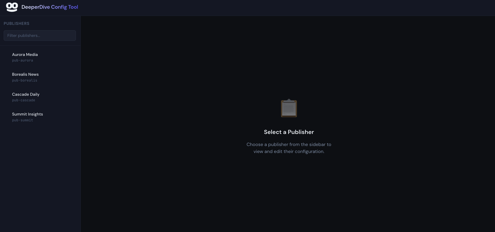
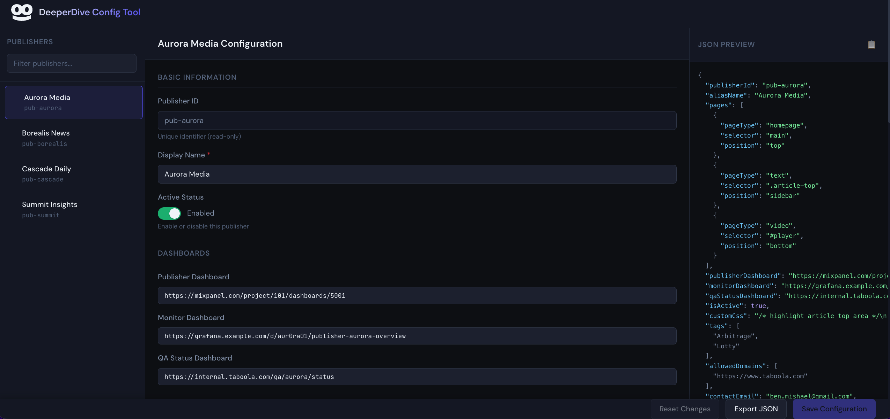
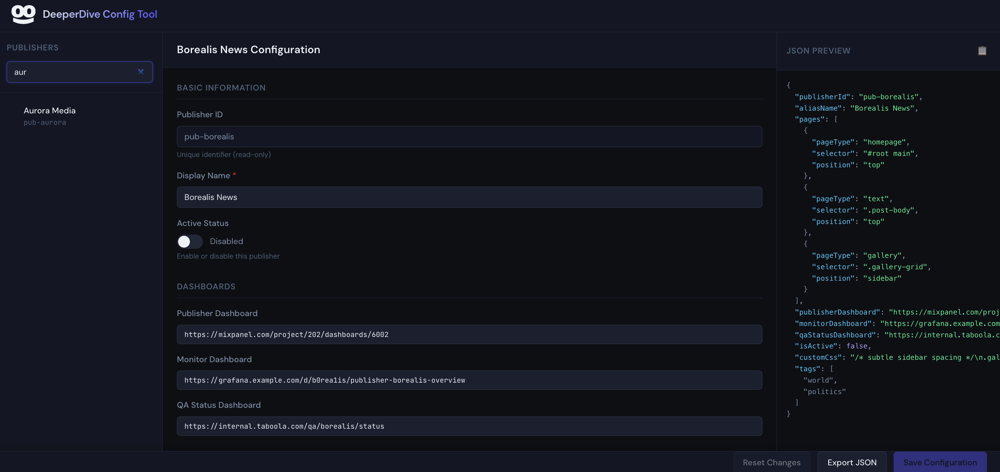
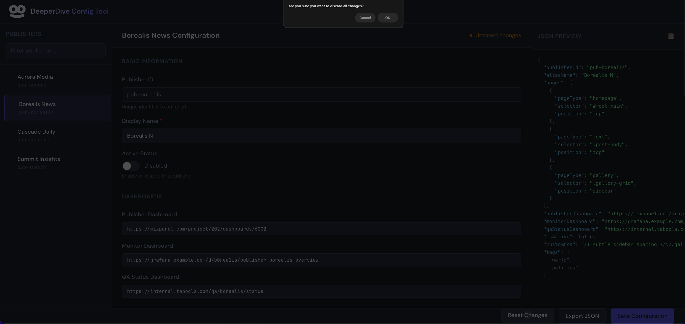
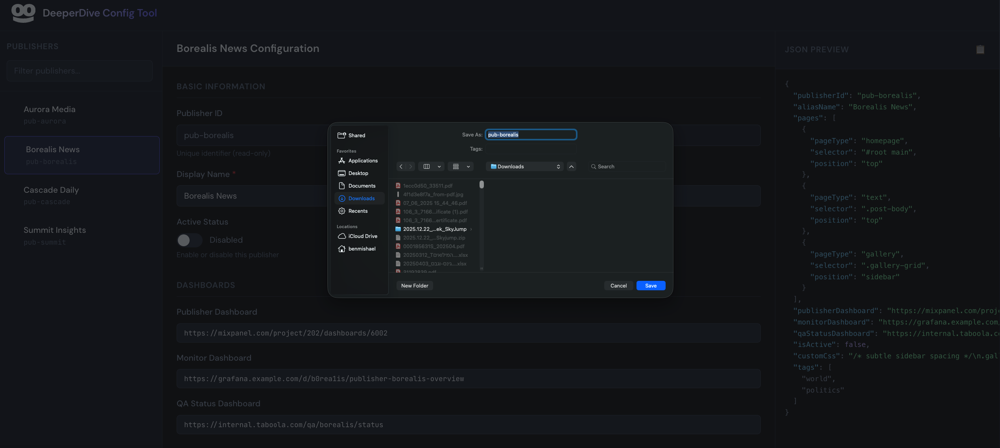
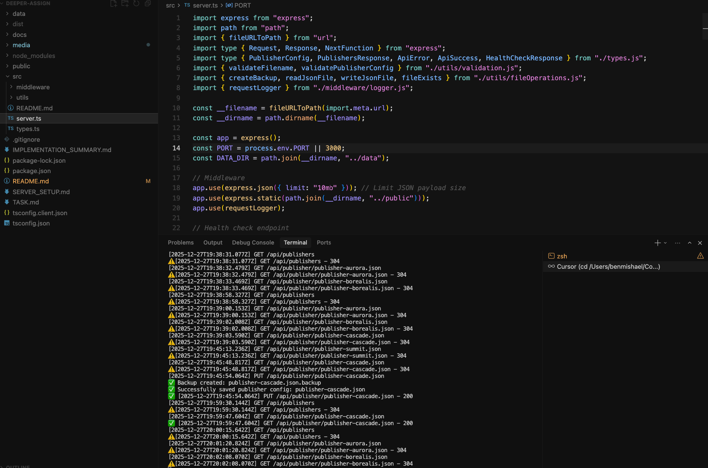

# DeeperDive Publisher Config Tool

A modern, web-based configuration management tool designed to help support engineers safely view and edit publisher configurations without worrying about JSON syntax errors. Built with TypeScript, Express.js, and a focus on user experience.


## 🎨 Screenshots

| | | |
|---|---|---|
| [](media/Screenshot_1.png) | [](media/Screenshot_2.png) | [](media/Screenshot_3.png) |
| [](media/Screenshot_4.png) | [](media/Screenshot_5.png) | [](media/Screenshot_6.png) |

## 🎬 Video
Check out the demo video to see **DeeperDive Publisher Config Tool** in action:

https://github.com/user-attachments/assets/9c414ae3-4f94-4c7f-a3bd-10a1f288b779


## 🎯 Overview

**DeeperDive Publisher Config Tool** is a visual configuration editor that transforms complex JSON editing into an intuitive, form-based interface. It eliminates common JSON syntax errors and provides real-time validation, making configuration management safe and efficient for technical users.

### The Problem It Solves

Support engineers frequently need to edit publisher configurations but struggle with:
- Finding the right configuration files
- Avoiding JSON syntax mistakes (commas, brackets, quotes)
- Understanding nested structures and arrays
- Keeping track of changes

This tool provides a **safe, visual, and intuitive** solution that protects users from common mistakes while maintaining the flexibility of JSON editing.

## ✨ Features

### Core Functionality
- **📋 Publisher Browser**: Searchable sidebar with all available publishers
- **✏️ Visual Form Editor**: Dynamic form generation based on configuration structure
- **👁️ Real-time Preview**: Live JSON preview with syntax highlighting
- **💾 Safe Saving**: Automatic validation and backup creation before saving
- **🔄 Change Tracking**: Visual indicators for unsaved changes
- **📤 Export**: Download configurations as formatted JSON

### Advanced Features
- **🎨 Dynamic Field Support**: Automatically detects and renders unknown fields
- **✅ Input Validation**: Real-time validation with error highlighting
- **🎭 Smooth Animations**: Professional UI animations (disabled during editing)
- **📱 Responsive Design**: Works seamlessly on desktop and mobile devices
- **🔍 Search & Filter**: Quickly find publishers by name or ID
- **⚡ Performance Optimized**: Efficient rendering without unnecessary re-renders

### Developer Features
- **🔒 Type Safety**: Full TypeScript coverage
- **🛡️ Security**: Path traversal protection, input validation, sanitization
- **📝 Request Logging**: Comprehensive server-side logging
- **💾 Automatic Backups**: Backup files created before each save
- **🏥 Health Check**: Server health monitoring endpoint

## 🛠️ Tech Stack

### Frontend
- **TypeScript** - Type-safe client-side code
- **Vanilla HTML/CSS** - No framework dependencies
- **Custom State Management** - Reactive store with subscriptions
- **DOM Utilities** - Lightweight DOM manipulation helpers

### Backend
- **Express.js** - RESTful API server
- **TypeScript** - Type-safe server code
- **File System Operations** - Safe JSON file handling

### Development Tools
- **Chrome DevTools MCP** - Used for browser automation and debugging during development
- **ESLint** - Code quality and consistency
- **tsx** - TypeScript execution for development

## 📁 Project Structure

```
Deeper-Assign/
├── public/                 # Frontend application
│   ├── css/
│   │   └── styles.css     # Main stylesheet
│   ├── images/
│   │   └── logo.svg       # Application logo
│   ├── ts/                # TypeScript source
│   │   ├── api.ts         # API client
│   │   ├── state.ts       # State management
│   │   ├── main.ts        # Application entry point
│   │   ├── types.ts       # Type definitions
│   │   ├── components/
│   │   │   └── editor.ts # Dynamic form editor
│   │   └── utils/
│   │       └── dom.ts     # DOM utilities
│   ├── js/                # Compiled JavaScript
│   └── index.html         # Main HTML file
│
├── src/                   # Backend server
│   ├── server.ts          # Express API server (port 3001)
│   ├── static-server.ts   # Static file server (port 3000)
│   ├── types.ts           # Server types
│   ├── utils/
│   │   ├── validation.ts  # Validation utilities
│   │   └── fileOperations.ts # File I/O utilities
│   └── middleware/
│       └── logger.ts      # Request logging
│
├── data/                  # Configuration files
│   ├── publishers.json    # Publisher registry
│   └── publisher-*.json   # Individual publisher configs
│
├── media/                 # Media assets (images, videos)
│   └── [screenshots, demos, etc.]
│
└── docs/                  # Additional documentation
```

## 🚀 Quick Start

### Prerequisites

- **Node.js** 18+ and npm
- Modern web browser (Chrome, Firefox, Safari, Edge)

### Installation

1. **Clone the repository**
   ```bash
   git clone https://github.com/BenMishael/Deeper-Assign/
   cd Deeper-Assign
   ```

2. **Install dependencies**
   ```bash
   npm install
   ```

3. **Build the client-side code**
   ```bash
   npm run build:client
   ```

4. **Start the development servers**
   ```bash
   npm run dev
   ```
   This starts both:
   - **API Server** on `http://localhost:3001` (handles API requests)
   - **Client Server** on `http://localhost:3000` (serves the frontend)

5. **Open your browser**
   ```
   http://localhost:3000
   ```
   
   > **Note**: The client automatically connects to the API server on port 3001.

### Production Build

```bash
# Build everything
npm run build

# Start production server
npm start
```

## 📖 Usage Guide

### Basic Workflow

1. **Browse Publishers**: Use the sidebar to view all available publishers. Use the search bar to filter by name or ID.

2. **Select a Publisher**: Click on any publisher to load its configuration.

3. **Edit Configuration**: 
   - Modify fields using the form editor
   - Required fields are marked with an asterisk (*)
   - Changes are tracked in real-time
   - JSON preview updates automatically

4. **Save Changes**: 
   - Click "Save Configuration" to persist changes
   - The server automatically creates a backup before saving
   - Success/error notifications appear at the bottom

5. **Export JSON**: Click "Export JSON" to download the current configuration.

### Field Types

The editor supports various field types:
- **Text Input**: Single-line text fields
- **URL Input**: Validated URL fields
- **Textarea**: Multi-line text (for CSS, notes, etc.)
- **Toggle Switch**: Boolean values (Active/Inactive)
- **String Arrays**: Lists of strings (tags, domains)
- **Object Arrays**: Complex nested objects (page configurations)
- **Read-only Fields**: Display-only fields (Publisher ID, Last Updated)

### Dynamic Fields

The tool automatically detects and renders fields that aren't in the predefined schema. These appear in the "Optional Settings" section with inferred types and labels.

## 🔌 API Documentation

### Endpoints

#### `GET /api/health`
Health check endpoint.

**Response:**
```json
{
  "status": "ok",
  "timestamp": "2024-01-01T00:00:00.000Z",
  "uptime": 123.45
}
```

#### `GET /api/publishers`
Get list of all publishers.

**Response:**
```json
{
  "publishers": [
    {
      "id": "pub-aurora",
      "alias": "Aurora Media",
      "file": "publisher-aurora.json"
    }
  ]
}
```

#### `GET /api/publisher/:filename`
Get a specific publisher configuration.

**Parameters:**
- `filename`: Publisher config filename (e.g., `publisher-aurora.json`)

**Response:**
```json
{
  "publisherId": "pub-aurora",
  "aliasName": "Aurora Media",
  "isActive": true,
  "pages": [...]
}
```

#### `PUT /api/publisher/:filename`
Save a publisher configuration.

**Parameters:**
- `filename`: Publisher config filename

**Request Body:** Publisher configuration object

**Response:**
```json
{
  "success": true,
  "message": "Publisher config saved successfully",
  "timestamp": "2024-01-01T00:00:00.000Z"
}
```

### Error Responses

All endpoints return errors in this format:

```json
{
  "error": "Error message",
  "details": "Additional details (development only)"
}
```

**HTTP Status Codes:**
- `400`: Bad Request (validation errors)
- `404`: Not Found (file doesn't exist)
- `500`: Internal Server Error


## 🧪 Development

### Development Workflow

During development, **Chrome DevTools MCP** was used extensively for:
- Browser automation and testing
- Real-time UI debugging
- Visual regression testing
- Performance monitoring
- Cross-browser compatibility checks

This tool enabled rapid iteration and ensured consistent behavior across different scenarios.

### Available Scripts

```bash
# Development
npm run dev          # Start both API (3001) and client (3000) servers with auto-reload
npm run dev:server   # Start only API server on port 3001
npm run dev:client   # Start only client server on port 3000
npm run build:client # Build client-side TypeScript
npm run build        # Build all TypeScript

# Code Quality
npm run lint         # Run ESLint

# Production
npm start            # Start both servers in production mode
npm run start:server # Start only API server
npm run start:client # Start only client server
```

### Port Configuration

- **Client Server**: Port `3000` - Serves the frontend application
- **API Server**: Port `3001` - Handles all API requests

The client automatically connects to the API server on port 3001 in development mode.

### Code Organization

- **Client-side**: Located in `public/ts/`
  - Modular architecture with clear separation of concerns
  - Reactive state management
  - Component-based UI rendering

- **Server-side**: Located in `src/`
  - RESTful API design
  - Utility functions for validation and file operations
  - Middleware for logging and error handling

### TypeScript Configuration

- **Client**: `tsconfig.client.json` - ES2020 target, DOM libs
- **Server**: `tsconfig.json` - ES2020 target, Node.js libs

## 🔒 Security Features

- **Path Traversal Protection**: Filename validation prevents directory traversal attacks
- **Input Validation**: All request bodies are validated before processing
- **JSON Sanitization**: Safe parsing with error handling
- **Payload Limits**: 10MB limit on request body size
- **Automatic Backups**: Files are backed up before modification

## 📝 Configuration Files

Publisher configurations are stored in the `data/` directory:

- `publishers.json` - Registry of all publishers
- `publisher-*.json` - Individual publisher configurations
- `*.backup` - Automatic backup files (excluded from git)

## 🤝 Contributing

This project follows best practices for:
- TypeScript type safety
- Code organization and modularity
- Error handling and validation
- User experience design

## 📄 License

This project is private and proprietary.

## 🙏 Acknowledgments

- Built with TypeScript for type safety
- Express.js for the RESTful API
- Chrome DevTools MCP for development and debugging
- Modern CSS for responsive design

## 📞 Support

For questions or issues, please refer to the documentation in:
- `src/README.md` - Server-side documentation
- `SERVER_SETUP.md` - Server implementation details
- `TASK.md` - Original project requirements

---

**Built with ❤️ using TypeScript and modern web technologies**

